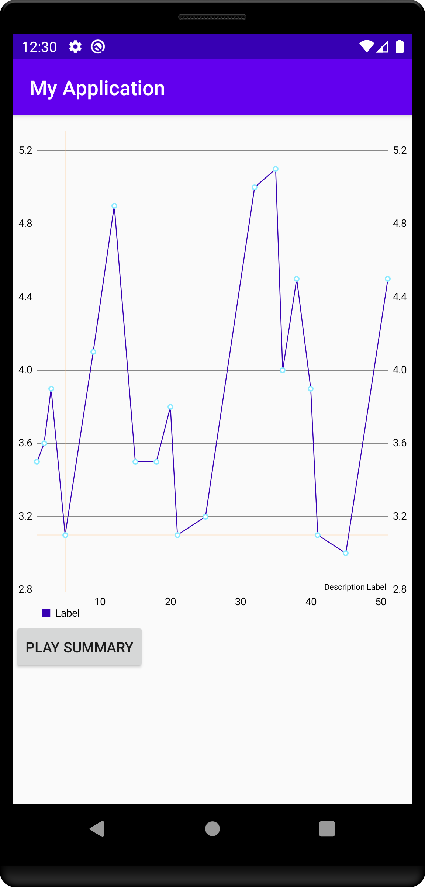

## Making charts accessible

This library is inspired by the charts feature on [Yahoo Finance app](https://play.google.com/store/apps/details?id=com.yahoo.mobile.client.android.finance). This enables you to add audio on any android line chart which plays different frequencies on dragging over a line chart.

<a href="https://youtu.be/oTN0TMMsrXM">  </a>

### Installation

To install copy the `ChartAudio.kt` file into your project.

### Usage
For an example usage with `MpAndroidChart` see `MainActivity.kt`

Initialize a `ChartAudio` object in you class which contains the chart view.

```
    val chartAudio by lazy {
        ChartAudioImpl()
    }
```

Tell the `chartAudio` object about the range of data it should expect

```
    chartAudio.setRange(Pair(min,max))
```


Set a touch listener on the chart to play a sound when a particular value is selected

```
     chartAudio.onPointFocused(value)
```


(Optional) To play a complete summary, pass the complete data set to this function

```
     chartAudio.playSummary(data)
```

(Optional) To play only in accessibility mode, add this check:
```
(getSystemService(Context.ACCESSIBILITY_SERVICE) as AccessibilityManager).isEnabled
```